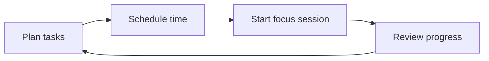

<div align="center">

# ✨ SuckT

### A calm productivity workspace for planning, focusing, and getting things done.

<p>
  <a href="https://github.com/maMai20/SuckTv2">
    
  </a>
  
  
  
</p>

<p>
  A frontend project that brings everyday productivity tools into one simple interface.
</p>

</div>

---

## 🌿 What is SuckT?

SuckT is a multi-feature productivity workspace built to help users organize tasks, plan time, and stay focused. It is also a hands-on frontend project focused on reusable React components, interactive UI, and practical product flows.

> **Project focus:** turning small, useful tools into one consistent and approachable experience.

## 🧩 Features

| Module | What it demonstrates |
| --- | --- |
| ✅ To-do list | Create and organize daily tasks |
| 🗓️ Calendar | Plan events with interactive calendar views |
| ⏱️ Focus timer | Support Pomodoro-style focus sessions |
| 🔐 Authentication UI | Login and registration screen flows |
| 🎞️ Ambient media | GIF and background-audio experiments |
| 🎨 UI system | Reusable components, CSS Modules, and theme-aware styling |

## 🔄 Product flow



## 🛠️ Built with

<p>
  
  
  
  
  
  
  
</p>

## 📁 Repository structure

This repository contains several frontend experiments and app iterations, primarily grouped under:

- `Frontend/`
- `SuckTv2/`

Each app directory has its own `package.json`. Open the app you want to run, then start the development server:

```bash
npm install
npm run dev
```

## 🎯 What I learned

- Designing a multi-feature frontend around a consistent user flow
- Building interactive date and time experiences
- Structuring reusable React components
- Managing styling across multiple UI modules
- Thinking about accessibility, responsiveness, and maintainability

## 🗺️ Roadmap

- [ ] Consolidate duplicated app iterations
- [ ] Add automated tests and linting
- [ ] Improve accessibility and responsive behavior
- [ ] Document API/data flow
- [ ] Add a polished live demo

## 👋 About the author

Built by **Kimmy** — a frontend developer learning by turning practical ideas into usable interfaces.

[](https://github.com/maMai20)

<div align="center">

### Thanks for visiting ⭐

</div>
